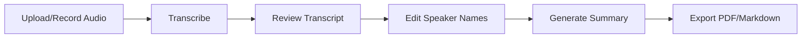

<h1 align="center">MeetMemo</h1>

<p align="center">
  <strong>AI-powered meeting transcription with speaker diarization and intelligent summarization</strong>
</p>

<p align="center">
  <a href="#features">Features</a> •
  <a href="#quick-start">Quick Start</a> •
  <a href="#usage">Usage</a> •
  <a href="#api-reference">API</a> •
  <a href="#deployment">Deployment</a>
</p>

<p align="center">
  
  
  
  
  
  
  
</p>

---

A meeting transcription application that runs entirely offline. It converts speech to text, identifies different speakers (diarization), and generates intelligent summaries of discussions. Connect it to your local LLM server for customized summarization. Perfect for meetings, interviews, lectures, or any audio where you need a clear transcript and actionable insights.

<div align="center">


</div>

## Table of Contents

- [Features](#features)
- [Architecture](#architecture)
- [Prerequisites](#prerequisites)
- [Quick Start](#quick-start)
- [Usage](#usage)
- [Configuration](#configuration)
- [API Reference](#api-reference)
- [Development](#development)
- [Deployment](#deployment)
- [Troubleshooting](#troubleshooting)
- [Security](#security)
- [License](#license)

## Features

| Feature | Description |
|---------|-------------|
| **Audio Recording & Upload** | Record meetings directly in browser or upload files (MP3, WAV, M4A, FLAC, WebM, OGG) |
| **Speech Recognition** | OpenAI Whisper (turbo model) for high-accuracy transcription in 99+ languages |
| **Speaker Diarization** | PyAnnote.audio 3.1 for automatic speaker identification and labeling |
| **AI Summarization** | LLM-powered summaries with key points, action items, and insights |
| **Real-time Progress** | Live status updates and job management for long-running tasks |
| **Speaker Management** | Edit speaker names with persistent storage across sessions |
| **Export Options** | Professional PDF and Markdown exports for transcripts and summaries |
| **Dark/Light Mode** | Theme toggle with responsive design |
| **Multi-language** | Automatic language detection or specify target language |

## Sample Outputs

The [`sample-files/`](sample-files/) directory contains example outputs demonstrating MeetMemo's capabilities:

<details>
<summary><strong>v2.0.0 Outputs (Current)</strong></summary>

| File | Description |
|------|-------------|
| `GenAI Week - AI x SaaS.wav` | Sample audio file (~36MB, ~1 hour) |
| `GenAI_Week_-_AI_x_SaaS_Transcript_2026-01-04_23-47.pdf` | Professional PDF transcript with speaker labels |
| `GenAI_Week_-_AI_x_SaaS_Transcript_2026-01-04_23-47.md` | Markdown transcript export |
| `GenAI_Week_-_AI_x_SaaS_2026-01-04_23-46.md` | AI-generated summary with insights |
| `MeetMemo-DEMO_v2.0.0.gif` | Application demo showcasing new UI |
| `sample-test.mp3` | Quick test audio file |

</details>

<details>
<summary><strong>v1.0.0 Outputs (Legacy)</strong></summary>

| File | Description |
|------|-------------|
| `genai-week---ai-x-saas_transcript_2025-08-31_v1.0.0.json` | Diarized transcript JSON |
| `genai-week---ai-x-saas_summary_2025-08-31_v1.0.0.pdf` | PDF summary |
| `genai-week---ai-x-saas_summary_2025-08-31_v1.0.0.markdown` | Markdown summary |
| `MeetMemo_Demo_v1.0.0.gif` | Legacy demo GIF |

</details>

## Architecture

```
┌─────────────────────────────────────────────────────────────────┐
│                         Nginx (Port 80)                         │
│                    Reverse Proxy + SSL Termination              │
└─────────────────────────┬───────────────────────────────────────┘
                          │
          ┌───────────────┴───────────────┐
          ▼                               ▼
┌─────────────────────┐         ┌─────────────────────┐
│   React Frontend    │         │   FastAPI Backend   │
│   (meetmemo-frontend)│         │  (meetmemo-backend) │
│                     │         │                     │
│  • Recording UI     │  REST   │  • Whisper (turbo)  │
│  • Transcript View  │◄───────►│  • PyAnnote 3.1     │
│  • Summary Display  │   API   │  • LLM Integration  │
│  • Export Options   │         │  • PDF Generation   │
└─────────────────────┘         └──────────┬──────────┘
                                           │
                                           ▼
                                ┌─────────────────────┐
                                │     PostgreSQL      │
                                │  (meetmemo-postgres)│
                                │                     │
                                │  • Job metadata     │
                                │  • Export jobs      │
                                │  • Transcriptions   │
                                └─────────────────────┘
```

### Tech Stack

| Component | Technology |
|-----------|------------|
| **Backend** | FastAPI, Python 3.10+, Uvicorn |
| **Frontend** | React 19, Lucide Icons, jsPDF |
| **ML Models** | OpenAI Whisper (turbo), PyAnnote.audio 3.1 |
| **Database** | PostgreSQL 16 with asyncpg |
| **Containerization** | Docker, Docker Compose, NVIDIA Container Toolkit |
| **PDF Generation** | ReportLab, svglib |

## Prerequisites

### Required Software

| Software | Purpose | Installation |
|----------|---------|--------------|
| Docker | Containerization | [Install Docker](https://docs.docker.com/get-docker/) |
| Docker Compose | Multi-container orchestration | [Install Compose](https://docs.docker.com/compose/install/) |
| NVIDIA Container Toolkit | GPU support | [Install Toolkit](https://docs.nvidia.com/datacenter/cloud-native/container-toolkit/install-guide.html) |

### Hardware Requirements

| Resource | Minimum | Recommended |
|----------|---------|-------------|
| **GPU** | NVIDIA with CUDA 11.8+ | RTX 3060+ or equivalent |
| **VRAM** | 4GB | 8GB+ |
| **RAM** | 8GB | 16GB+ |
| **Storage** | 10GB | 20GB+ (for models and audio) |

### External Services

| Service | Purpose | Setup |
|---------|---------|-------|
| **Hugging Face** | PyAnnote model access | [Create token](https://huggingface.co/settings/tokens) |
| **LLM API** | Summarization | OpenAI-compatible endpoint |

## Quick Start

### 1. Clone the Repository

```bash
git clone https://github.com/NotYuSheng/MeetMemo.git
cd MeetMemo
```

### 2. Accept Hugging Face Model Licenses

Visit these pages and accept the user agreement:

- [Speaker Diarization 3.1](https://huggingface.co/pyannote/speaker-diarization-3.1)
- [Segmentation 3.0](https://huggingface.co/pyannote/segmentation-3.0)

### 3. Create Hugging Face Token

1. Go to [Hugging Face Tokens](https://huggingface.co/settings/tokens)
2. Click **New token** → Select **Read** scope → Copy token

### 4. Configure Environment

```bash
cp example.env .env
```

Edit `.env` with your settings:

```env
# Required
HF_TOKEN=hf_your_token_here
LLM_API_URL=http://localhost:1234
LLM_MODEL_NAME=qwen2.5-14b-instruct

# Optional
LLM_API_KEY=                    # Leave empty for local LLM servers
POSTGRES_PASSWORD=changeme      # Change in production!
TIMEZONE_OFFSET=+8              # Your timezone offset
NVIDIA_VISIBLE_DEVICES=all      # GPU selection
```

### 5. Build and Run

```bash
docker compose build
docker compose up
```

### 6. Access the Application

Open your browser: **http://localhost**

> **Note:** For recording features, HTTPS is required in production. See [Deployment](#deployment) for options.

## Usage

### Basic Workflow



1. **Upload/Record** - Upload an audio file or record directly in browser
2. **Transcribe** - Click "Start Transcription" to process audio
3. **Review** - View diarized transcript with speaker labels and timestamps
4. **Customize** - Click speaker names to rename them (persists across sessions)
5. **Summarize** - Generate AI summary with key insights and action items
6. **Export** - Download professional PDF or Markdown files

### Advanced Features

| Feature | Description |
|---------|-------------|
| **Custom Prompts** | Tailor summarization (technical analysis, action items only, etc.) |
| **Speaker Identification** | AI-powered speaker name suggestions based on context |
| **Batch Processing** | Handle multiple audio files with job management |
| **Quality Control** | Automatic audio preprocessing (mono, 16kHz resampling) |
| **Duplicate Detection** | Prevents re-uploading the same audio file |

## Configuration

### Environment Variables

| Variable | Required | Description | Default |
|----------|----------|-------------|---------|
| `HF_TOKEN` | Yes | Hugging Face API token | - |
| `LLM_API_URL` | Yes | LLM endpoint (base URL, no `/v1/chat/completions`) | - |
| `LLM_MODEL_NAME` | Yes | Model identifier | - |
| `LLM_API_KEY` | No | LLM authentication key | Empty |
| `POSTGRES_PASSWORD` | No | Database password | `changeme` |
| `TIMEZONE_OFFSET` | No | Hours offset from UTC | `+8` |
| `NVIDIA_VISIBLE_DEVICES` | No | GPU selection (`all`, `0`, `0,1`) | `all` |

### Whisper Models

| Model | VRAM | Speed | Accuracy | Use Case |
|-------|------|-------|----------|----------|
| `tiny` | ~1GB | Fastest | Basic | Quick drafts |
| `base` | ~1GB | Fast | Good | General use |
| `small` | ~2GB | Moderate | Better | Meetings |
| `medium` | ~5GB | Slow | High | Important recordings |
| `large` | ~10GB | Slowest | Highest | Critical accuracy |
| `turbo` | ~6GB | Fast | High | **Default** - Best balance |

### Docker Volumes

| Volume | Container Path | Purpose |
|--------|----------------|---------|
| `audiofiles` | `/app/audiofiles` | Uploaded audio files |
| `transcripts` | `/app/transcripts` | Generated transcriptions |
| `summary` | `/app/summary` | AI summaries |
| `exports` | `/app/exports` | PDF/Markdown exports |
| `logs` | `/app/logs` | Application logs |
| `whisper_cache` | `/root/.cache/whisper` | Whisper model cache |
| `huggingface_cache` | `/root/.cache/huggingface` | PyAnnote model cache |
| `torch_cache` | `/root/.cache/torch` | PyTorch cache |
| `postgres_data` | `/var/lib/postgresql/data` | Database storage |

## API Reference

All endpoints are prefixed with `/api/v1`.

### Health

| Method | Endpoint | Description |
|--------|----------|-------------|
| `GET` | `/health` | Health check and system status |

### Jobs

| Method | Endpoint | Description |
|--------|----------|-------------|
| `GET` | `/jobs` | List all jobs (supports `?limit=` and `?offset=`) |
| `POST` | `/jobs` | Create job with audio file upload |
| `GET` | `/jobs/{uuid}` | Get job status and metadata |
| `PATCH` | `/jobs/{uuid}` | Rename job |
| `DELETE` | `/jobs/{uuid}` | Delete job and associated files |

### Transcription Workflow

| Method | Endpoint | Description |
|--------|----------|-------------|
| `POST` | `/jobs/{uuid}/transcriptions` | Start Whisper transcription |
| `GET` | `/jobs/{uuid}/transcriptions` | Get raw transcription data |
| `POST` | `/jobs/{uuid}/diarizations` | Start speaker diarization |
| `GET` | `/jobs/{uuid}/diarizations` | Get diarization data |
| `POST` | `/jobs/{uuid}/alignments` | Align transcription with diarization |

### Transcript

| Method | Endpoint | Description |
|--------|----------|-------------|
| `GET` | `/jobs/{uuid}/transcript` | Get aligned transcript |
| `PATCH` | `/jobs/{uuid}/transcript` | Update transcript content |

### Summary

| Method | Endpoint | Description |
|--------|----------|-------------|
| `GET` | `/jobs/{uuid}/summary` | Get or generate summary |
| `POST` | `/jobs/{uuid}/summary` | Generate with custom prompt |
| `PATCH` | `/jobs/{uuid}/summary` | Update cached summary |
| `DELETE` | `/jobs/{uuid}/summary` | Delete cached summary |

### Speakers

| Method | Endpoint | Description |
|--------|----------|-------------|
| `PATCH` | `/jobs/{uuid}/speakers` | Update speaker names |
| `POST` | `/jobs/{uuid}/speaker-identifications` | AI speaker identification |

### Exports

| Method | Endpoint | Description |
|--------|----------|-------------|
| `GET` | `/jobs/{uuid}/exports/pdf` | Download summary as PDF |
| `GET` | `/jobs/{uuid}/exports/markdown` | Download summary as Markdown |
| `GET` | `/jobs/{uuid}/exports/transcript/pdf` | Download transcript as PDF |
| `GET` | `/jobs/{uuid}/exports/transcript/markdown` | Download transcript as Markdown |

### Async Exports

| Method | Endpoint | Description |
|--------|----------|-------------|
| `POST` | `/jobs/{uuid}/exports` | Create async export job |
| `GET` | `/jobs/{uuid}/exports/{export_uuid}` | Get export job status |
| `GET` | `/jobs/{uuid}/exports/{export_uuid}/download` | Download completed export |
| `DELETE` | `/jobs/{uuid}/exports/{export_uuid}` | Delete export job |

## Development

### Frontend

```bash
cd frontend
npm install
npm start          # Development server (HTTPS)
npm run build      # Production build
npm test           # Run tests
npm run lint:css   # Lint CSS
```

### Backend

```bash
cd backend
pip install -r requirements.txt
python main.py     # Run FastAPI server
```

### Docker

```bash
# Build and run
docker compose build
docker compose up -d

# View logs
docker compose logs -f meetmemo-backend
docker compose logs -f meetmemo-frontend

# Restart service
docker compose restart meetmemo-backend

# Stop all
docker compose down
```

### Code Quality

```bash
# Frontend CSS linting
cd frontend && npm run lint:css:fix

# Backend Python linting
cd backend
ruff check .
ruff format .
```

## Deployment

### HTTPS Requirement

**HTTPS is required for browser recording** (microphone access needs secure context). HTTP works on `localhost` for development.

### Deployment Options

<details>
<summary><strong>Option 1: Cloudflare Tunnel (Recommended)</strong></summary>

Free HTTPS with zero certificate management:

```bash
# Install
curl -L https://github.com/cloudflare/cloudflared/releases/latest/download/cloudflared-linux-amd64 -o cloudflared
chmod +x cloudflared && sudo mv cloudflared /usr/local/bin/

# Setup
cloudflared tunnel login
cloudflared tunnel create meetmemo

# Configure (~/.cloudflared/config.yml)
tunnel: <tunnel-id>
credentials-file: ~/.cloudflared/<tunnel-id>.json
ingress:
  - hostname: meetmemo.yourdomain.com
    service: http://localhost:80
  - service: http_status:404

# Run
cloudflared tunnel run meetmemo
```

</details>

<details>
<summary><strong>Option 2: Tailscale (Private Network)</strong></summary>

Perfect for internal/team use:

```bash
curl -fsSL https://tailscale.com/install.sh | sh
sudo tailscale up
tailscale serve https / proxy http://127.0.0.1:80
```

Access via `https://<machine-name>.tail-scale.ts.net`

</details>

<details>
<summary><strong>Option 3: Caddy (Auto-HTTPS)</strong></summary>

```bash
# Install Caddy (add repository first)
sudo apt install -y debian-keyring debian-archive-keyring apt-transport-https
curl -1sLf 'https://dl.cloudsmith.io/public/caddy/stable/gpg.key' | sudo gpg --dearmor -o /usr/share/keyrings/caddy-stable-archive-keyring.gpg
curl -1sLf 'https://dl.cloudsmith.io/public/caddy/stable/debian.deb.txt' | sudo tee /etc/apt/sources.list.d/caddy-stable.list
sudo apt update && sudo apt install caddy

# /etc/caddy/Caddyfile
meetmemo.yourdomain.com {
    reverse_proxy localhost:80
}

sudo systemctl restart caddy
```

</details>

<details>
<summary><strong>Option 4: Nginx + Let's Encrypt</strong></summary>

```bash
sudo apt install certbot python3-certbot-nginx
sudo certbot --nginx -d meetmemo.yourdomain.com
```

> **Important:** To avoid port conflicts with the host's Nginx, change the port mapping for the `meetmemo-frontend` service in `docker-compose.yml` from `"80:80"` to `"8080:80"`. Then configure your Nginx to `proxy_pass http://localhost:8080`.

</details>

### Production Checklist

- [ ] Set strong `POSTGRES_PASSWORD`
- [ ] Configure HTTPS (see options above)
- [ ] Set up `HF_TOKEN` and LLM credentials
- [ ] Test recording feature with HTTPS
- [ ] Configure firewall rules
- [ ] Set up backup for PostgreSQL volume
- [ ] Configure log rotation

## Troubleshooting

### Common Issues

| Issue | Solution |
|-------|----------|
| GPU not detected | Install NVIDIA Container Toolkit and restart Docker |
| Model download fails | Verify HF token and license acceptance |
| Recording not working | HTTPS required (use deployment options above) |
| Out of memory | Use smaller Whisper model or restart backend |
| PyTorch warning | Run suggested upgrade command in container |

### Performance Tips

- **Faster processing**: Use `base` or `small` Whisper models
- **Better accuracy**: Use `turbo` or `large` with quality audio
- **Memory**: Restart backend after large files to free VRAM
- **Audio quality**: 16kHz+ mono WAV gives best diarization

## Security

| Aspect | Implementation |
|--------|----------------|
| **Local Processing** | Transcription and diarization run entirely on your infrastructure |
| **Data Privacy** | Audio never leaves your server (except for LLM summarization) |
| **Secure Storage** | Docker volumes with proper permissions |
| **HTTPS** | SSL/TLS support for production deployments |
| **File Validation** | Type and size validation on upload |
| **No Auth by Default** | Add authentication layer for multi-user production |

## Star History

If you find MeetMemo useful, consider giving it a star! Your support helps others discover this project and motivates continued development.

<a href="https://star-history.com/#NotYuSheng/MeetMemo&Date">
  <picture>
    <source media="(prefers-color-scheme: dark)" srcset="https://api.star-history.com/svg?repos=NotYuSheng/MeetMemo&type=Date&theme=dark" />
    <source media="(prefers-color-scheme: light)" srcset="https://api.star-history.com/svg?repos=NotYuSheng/MeetMemo&type=Date" />
    
  </picture>
</a>

## License

This project is licensed under the MIT License. See [LICENSE](LICENSE) for details.

---

<p align="center">
  <sub>Built with AI assistance from Claude</sub>
</p>
